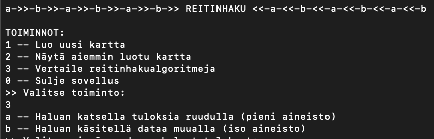

# Käyttöohje

## Sovelluksen käynnistys ja testaus

### Sovellusprojektin käynnistys jar-tiedostosta

Lataa jar-tiedosto omalle koneellesi Releases-osiosta:
https://github.com/ruusukivi/tiralabra/releases/

Käynnistä sovellus sen jälkeen komentoriviltä komennolla: 

    java -jar reitinhakusovellus.jar

### Sovellusprojektin käynnistys komentoriviltä

Kloonaa tai forkkaa projekti ensin omalle koneellesi. Tämän jälkeen projektin voi käynnistää seuraavalla komennolla:

    ./gradlew -q --console plain run

### Sovelluksen yksikkötestien ajo

    ./gradlew clean test

### Sovelluksen koodin tarkistus

    ./gradlew checkstyleMain

- Raportit löytyvät tämän jälkeen projektin hakemistosta: /tiralabra/reitinhakusovellus/build/reports/checkstyle/

### Sovelluksen testikattavuusraportin päivitys

    ./gradlew jacocoTestReport

- Raportit löytyvät tämän jälkeen projektin hakemistosta: /tiralabra/reitinhakusovellus/build/reports/jacoco/test/

### Sovelluksen javadoc-dokumentaation tarkistaminen ja päivitys

    ./gradlew javadoc

- Raportit löytyvät tämän jälkeen projektin hakemistosta: /tiralabra/reitinhakusovellus/build/docs/javadoc/

## Sovelluksen käyttö

Sovelluksessa tällä hetkellä kaksi toimintoa:
1) Uuden kartan luonti ja tulostus
2) Session aikana luotujen karttojen uudelleen tulostus
3) Algoritmien vertailu

Uuden kartan luonti luo karttapohjan RandomWalk-algoritmia hyödyntäen ja etsii kartalta lyhyimmän reitin vasemmasta yläkulmasta oikeaan alakulmaan Dijkstra- ja Jump Point Search -algoritmeilla.

Uuden kartan luonti generoi omat Verkko-olio Dijkstralle ja Jump Point Searchille. Tulostettaessa aiemmin luotua karttaa pitää valita kumman version haluaa nähdä.

Algoritmien vertailu luo taustalla muutamia karttoja, tekee niistä verkot ja etsiin lyhyimmät reitit Dijkstralla ja JumpPointSearchilla. Tämän jälkeen käyttöliittymään tulostetaan vertailutietoja: reitin pituus, haun kesto, kekoon viedyt solmut.

Tällä hetkellö vertailuja tehdään seuraavilla parametreilla luoduilla kartoilla:
- sivu: 1000, tunneleita: 10000, tunnelin maksimi pituus: 500, nimi: "1000-1000-500");
- sivu: 1000, tunneleita: 10000, tunnelin maksimi pituus: 500, nimi: "1000-1000-500");
- sivu: 1000, tunneleita: 1000, tunnelin maksimi pituus: 500, nimi: "1000-1000-500");
- sivu: 1000, tunneleita: 100, tunnelin maksimi pituus: 500, nimi: "1000-10-500");
