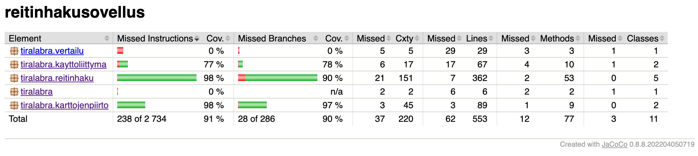

# Testausdokumentti 

## Yksikkötestaus

Testauksen ulkopuolelle jätetty IO-luokan tulosta- ja lue-metodit sekä sovelluksen käynnistävä luokka.

## Dijkstran toimivuuden testaus

Sain jo alkuvaiheessa tulostettua reitin kartalle käyttöliittymässä, jolloin oli helppo arvioida sen oikeellisuutta. Varmistin lisäksi muutaman pienen kartan osalta käsin laskemalla, että reitti ja sen pituus ovat oikein.

Algoritmia koodatessa tulostin konsoliin jokaisen vaiheen (esim. keossa käsittelyn aikana olevat solmut). 

Algoritmi testataan yksikkötesteissä seuraavilla aineistoilla:
1) kartalla, jossa ei ole reittiä lainkaan 
2) 3x3 kartalla, jossa keskellä seinä
3) 100x100 kartalla, jossa ei ole esteitä lainkaan

## Jump Point Searchin toimivuuden testaus

Minulla kesti pitkään saada JPS toimimaan oikein. Jäljitin virheitä lisäämällä koodiin valtavan määrän tarkistustulosteita. 

Kartanpiirron sain toimimaan vasta loppuvaiheessa. Kun piirto toimi, vertailin JPS:n löytämää reittiä ja sen pituutta Dijkstraan.

Algoritmi testataan yksikkötesteissä seuraavilla aineistoilla:
1) kartalla, jossa ei ole reittiä lainkaan 
2) 3x3 kartalla, jossa keskellä seinä
3) 100x100 kartalla, jossa ei ole esteitä lainkaan

##  Algoritmien vertailu

Algoritmien vertailua varten on luotu Vertailu-luokka, jolla voi tulostaa joko laajemman csv-muotoillun aineiston tai luettavammaksi muotoillun suppeamman aineiston.

Päädyin testaamaan karttoja kolmenlaisilla asetuksilla. 

- 1000-100-1000 - kartan sivun pituus 1000, polkujen määrä 100 ja polun maksimipituus 1000
- 1000-150-1000 - kartan sivun pituus 1000, polkujen määrä 150 ja polun maksimipituus 1000
- 1000-200-1000 - kartan sivun pituus 1000, polkujen määrä 200 ja polun maksimipituus 1000

Loin jokaisilla asetuksilla noin 1100 karttaa ja vertailin sen jälkeen Dijkstran ja Jump Pointin keskiarvoja nopeuden ja kekoon vietyjen solmujen määrän osalta. Varmistin myös, että reittien pituudet olivat samat ja ettei reitittömillä kartoilla kumpikaan algoritmi löytänyt reittiä.

Kartoilla, joilla polkujen määrä oli vertailuaineiston suurin, JPS oli keskimäärin 3,44 kertaa nopeampi kuin Dijkstra. 

Kartoilla, jolla polkujen määrä oli 150, JPS oli keskimäärin 3,38 kertaa nopeampi kuin Dijkstra. 

Kartoilla, joilla polkujen määrä oli vertailuaineiston pienin, JPS oli keskimäärin 3,23 kertaa nopeampi. 

Näyttäisi aineiston perusteella, että mitä enemmän polkuja on, sitä paremmin JPS toimii suhteessa Dijkstraan. JPS vie kaikissa tapauksissa selvästi vähemmän solmuja kekoon kuin Dijkstra, mutta Dijkstra nopeutuu enemmän mitä vähemmän polkuja eli tutkittavaa kartalla on.

Kokeilin ajaa karttaa asetuksilla myös 1000-100000-1000. Tällaisella kartalla ei käytännössä ole lainkaan esteitä. JPS oli 8,86 kertaa nopeampi kuin Dijkstra.

Tein myös testejä kartoilla, jos polkuja oli huomattavasti enemmän kuin vertailuaineistoissa, mutta kuitenkin niin vähän, ettei kartta ole esteetön vaan täynnä pieniä irtonaisia esteitä. Tällaisella kartalla testattaessa JPS on välillä jopa Dijkstraa hitaampi.

