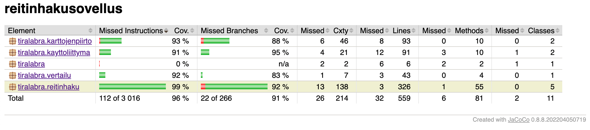
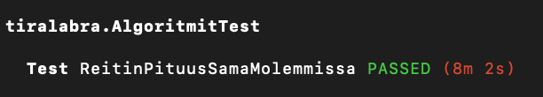
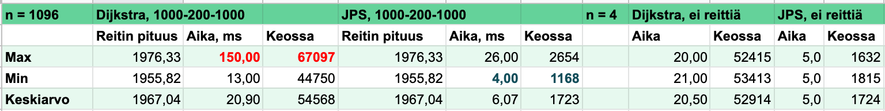
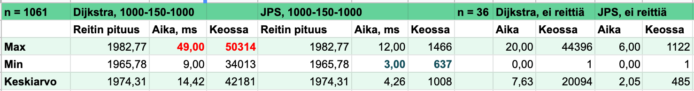
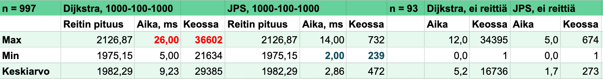

# Testausdokumentti 

## Yksikkötestaus

Testauksen ulkopuolelle jätetty 
- IO-luokan tulosta- ja lue-metodit
- sovelluksen käynnistävä luokka
- osa kartan tulostukseen ja talennukseen liittyvistä tapauksista

## Dijkstran toimivuuden testaus

Sain jo alkuvaiheessa tulostettua reitin kartalle käyttöliittymässä, jolloin oli helppo arvioida sen oikeellisuutta. Varmistin lisäksi muutaman pienen kartan osalta käsin laskemalla, että reitti ja sen pituus ovat oikein.

Algoritmia koodatessa tulostin konsoliin jokaisen vaiheen (esim. keossa käsittelyn aikana olevat solmut). 

Algoritmi testataan yksikkötesteissä seuraavilla aineistoilla:
1) kartalla, jossa ei ole reittiä lainkaan 
2) 3x3 kartalla, jossa keskellä seinä
3) 100x100 kartalla, jossa ei ole esteitä lainkaan
4) Satunnaisesti generoidulla 1000x1000 kartalla

Testeissä 2-4 reitti etsitään ensin aloituspisteestä 0.0 lopetuspisteeseen (sivu-1).(sivu-1) ja sen jälkeen vaihdetaan aloitus- ja lopetuspisteiden paikat ja etsitään reitti uudestaan. Testit menevät läpi, jos reitit ovat samanmittaiset. 

## Jump Point Searchin toimivuuden testaus

Minulla kesti pitkään saada JPS toimimaan oikein. Jäljitin virheitä lisäämällä koodiin valtavan määrän tarkistustulosteita. 

Kartanpiirron sain toimimaan vasta loppuvaiheessa. Kun piirto toimi, vertailin JPS:n löytämää reittiä ja sen pituutta Dijkstraan.

Algoritmi testataan yksikkötesteissä seuraavilla aineistoilla:
1) Kartalla, jossa ei ole reittiä lainkaan 
2) 3x3 kartalla, jossa keskellä seinä 
3) 100x100 kartalla, jossa ei ole esteitä lainkaan 
4) Satunnaisesti generoidulla 10x10 kartalla 

Testeissä 2-4 reitti etsitään ensin aloituspisteestä 0.0 lopetuspisteeseen (sivu-1).(sivu-1) ja sen jälkeen vaihdetaan aloitus- ja lopetuspisteet keskenään ja varmistetaan, että löydetyt reitit ovat samanmittaiset. Isoilla kartoilla JPS:n käänteiset reitit eivät aina täsmää pituudeltaan - kurssiajan puitteissa en onnistunut löytämään tämän aiheuttavaa bugia ja siksi testi ajetaan pienemmällä kartalla kuin Dijkstran vastaava.  

##  Algoritmien suorituskyky

Yksikkötesteihin kuuluva [AlgoritmitTest.java](../reitinhakusovellus/src/test/java/tiralabra/AlgoritmitTest.java) luo 2 000 isoa karttaa ja varmistaa, että molemmat algoritmit tuottavat saman tuloksen reitin löytymisen ja pituuden osalta. Testillä arvioidaan sekä algoritmien toiminnan oikeellisuutta että suorituskykyä. 

Testin ajaminen kestää lähes kymmenen minuuttia ja se on merkitty @Ignore-annotaatiolla eli sitä ei oletusarvoisesti ajeta. 

Olen ajanut testin muutaman kerran läpi ja suoritukset ovat menneet ongelmatta läpi. 

##  Algoritmien toimivuuden vertailu

Algoritmien nopeus- ja tehokkuusvertailua varten on luotu Vertailu-luokka, jolla voi tulostaa joko laajemman csv-muotoillun aineiston tai luettavammaksi muotoillun suppeamman aineiston.

Päädyin testaamaan karttoja kolmenlaisilla asetuksilla. 

- 1000-100-1000 - kartan sivun pituus 1000, polkujen määrä 100 ja polun maksimipituus 1000
- 1000-150-1000 - kartan sivun pituus 1000, polkujen määrä 150 ja polun maksimipituus 1000
- 1000-200-1000 - kartan sivun pituus 1000, polkujen määrä 200 ja polun maksimipituus 1000

Loin jokaisilla asetuksilla yli 1000 karttaa ja vertailin sen jälkeen Dijkstran ja Jump Point Searchin keskiarvoja nopeuden ja kekoon vietyjen solmujen määrän osalta. Varmistin myös, että reittien pituudet olivat samat ja ettei reitittömillä kartoilla kumpikaan algoritmi löytänyt reittiä.

Kartoilla, joilla polkujen määrä oli vertailuaineiston suurin, JPS oli keskimäärin 3,44 kertaa nopeampi kuin Dijkstra. 

Kartoilla, jolla polkujen määrä oli 150, JPS oli keskimäärin 3,38 kertaa nopeampi kuin Dijkstra. 

Kartoilla, joilla polkujen määrä oli vertailuaineiston pienin, JPS oli keskimäärin 3,23 kertaa nopeampi. 

Näyttäisi aineiston perusteella, että mitä enemmän polkuja on, sitä paremmin JPS toimii suhteessa Dijkstraan. JPS vie kaikissa tapauksissa selvästi vähemmän solmuja kekoon kuin Dijkstra, mutta Dijkstra nopeutuu enemmän mitä vähemmän polkuja eli tutkittavaa kartalla on.

Kokeilin ajaa karttaa myös asetuksilla 1000-100000-1000. Tällaisella kartalla ei käytännössä ole lainkaan esteitä. JPS oli 8,86 kertaa nopeampi kuin Dijkstra.

Tein myös testejä kartoilla, jossa polkuja oli huomattavasti enemmän kuin vertailuaineistossa, mutta kuitenkin niin vähän, ettei kartta ole esteetön vaan täynnä pieniä irtonaisia esteitä. Tällaisella kartalla testattaessa JPS on välillä jopa Dijkstraa hitaampi.

