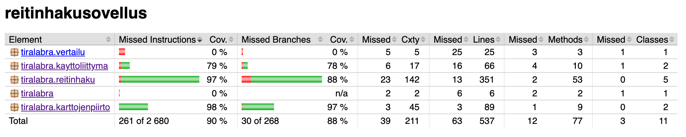

# Testausdokumentti 

## Yksikkötestaus

Testauksen ulkopuolelle jätetty IO-luokan tulosta- ja lue-metodit sekä sovelluksen käynnistävä luokka.

## Dijkstran toimivuuden testaus

Dijkstra-algoritmi testataan yksikkötesteissä tällä hetkellä:
1) kartalla, jossa ei ole reittiä lainkaan 
2) 3x3 kartalla, jossa keskellä seinä
3) 100x100 kartalla, jossa ei ole esteitä lainkaan

Jokainen reitti alkaa neliömuotoisen kartan vasemmasta ylälaidasta ja päättyy oikeaan alakulmaan. Jokaisella kartalla ei välttämättä ole reittiä. Reitillisiä karttoja saa luotua todennäköisimmin luotua siten, että valitsee tunnelin maksimipituudeksi kartan sivun pituuden ja tunnelin määrän vähintään kaksinkertaiseksi sivun pituuteen verrattuna (Esim. sivu 100, tunneleita 500  ja tunnelin pituus 100).

Jos reitti löytyy, se tulostetaan käyttöliittymään sekä karttakuvaan että etappi kerrallaan siten, että näkyvillä ovat:
- etapin x- ja y-koordinaatit 
- etäisyys etapin ja aloituspisteen välillä. 
Tämä mahdollistaa silmämääräisen tarkistamisen reitille.

Algoritmia koodatessa tulostin konsoliin jokaisen vaiheen (esim. mitä solmuja on keossa). Lisäksi varmistin muutaman pienen kartan osalta käsin laskemalla, että reitti ja sen pituus ovat oikein.

## Jump Point Searchin toimivuuden testaus

##  Algoritmien vertailu
- Tulossa: vertailutestit siitä tuottavatko Dijkstra ja JPS:ssä yhtä lyhyen reitin
- Tulossa: vertailutestit siitä kuinka nopeasti Dijkstra ja JPS löytävät lyhyimmän reitin
- Tulossa: reitin aloitus- ja lopetuspisteiden valinta satunnaisesti
- Tulossa: käyttöliittymään toiminto, joka generoi kymmeniä erikokoisia karttoja, ajaa niille vertailutestit ja tulostaa lopuksi tilaston vertailusta
