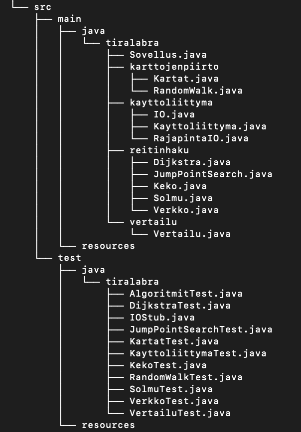

# Toteutusdokumentti 

## Ohjelman yleisrakenne

Sovellus on paketoitu tiralabra-domaiin, jonka alla vielä paketit karttojen piirrolle, käyttöliittymälle ja reitinhaulle.

## Saavutetut aika- ja tilavaativuudet (m.m. O-analyysit pseudokoodista)

## Suorituskyky- ja O-analyysivertailu (mikäli työ vertailupainotteinen)

## Puutteet ja parannusehdotukset

Käyttöliittymän virheensieto ei vielä ole kovin hyvä, koska syötteitä ei validoida.

## Lähteet

Abdolsaheb, A. How to code your own procedural dungeon map generator using the Random Walk Algorithm
https://www.freecodecamp.org/news/how-to-make-your-own-procedural-dungeon-map-generator-using-the-random-walk-algorithm-e0085c8aa9a/

Dijkstran algoritmi. Wikipedia. https://fi.wikipedia.org/wiki/Dijkstran_algoritmi

Harabor, D. & Grastien, A.
Improving Jump Point Search. NICTA and The Australian National University. 
https://users.cecs.anu.edu.au/~dharabor/data/papers/harabor-grastien-icaps14.pdf 

Laaksonen, A. 2021. Tietorakenteet ja algoritmit. https://www.cs.helsinki.fi/u/ahslaaks/tirakirja/ 

Sumit, J. 2018. Dijkstra’s – Shortest Path Algorithm (SPT) https://algorithms.tutorialhorizon.com/dijkstras-shortest-path-algorithm-spt/

Sumit, J. 2018. Dijkstra’s – Shortest Path Algorithm (SPT) – Adjacency List and Min Heap – Java Implementation. https://algorithms.tutorialhorizon.com/dijkstras-shortest-path-algorithm-spt-adjacency-list-and-min-heap-java-implementation/ 

Sumit, J. 2015. Binary Min-Max Heap Implementation https://algorithms.tutorialhorizon.com/binary-min-max-heap/

Witmer, N. 2014. A Visual Explanation of Jump Point Search. Zerowidth positive lookahead.
https://zerowidth.com/2013/a-visual-explanation-of-jump-point-search.html

Muita Tira-kurssin harjoitustöitä:
- https://github.com/sinisaarinen/tira-labra
- https://github.com/NooraVino/GetMeOut-tiralabra
- https://github.com/ALindroos/Polunhakija 
