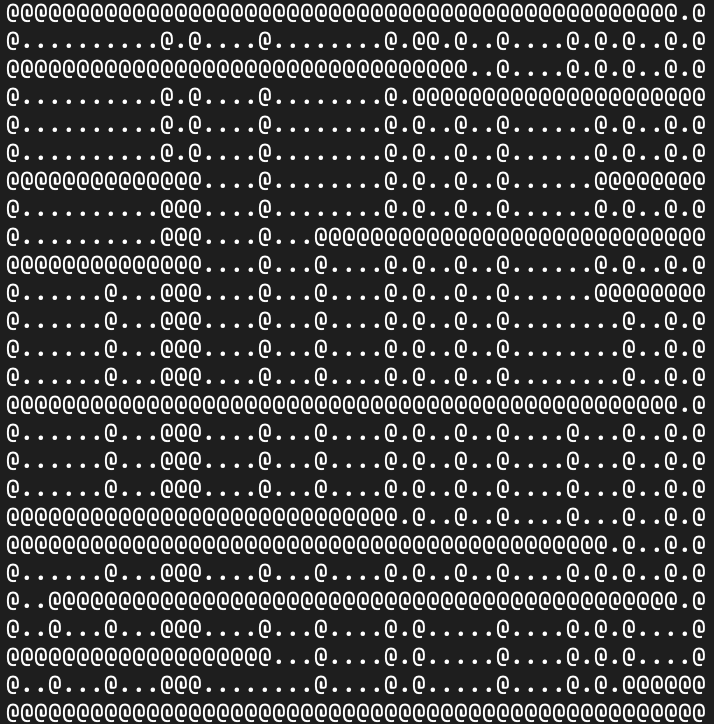

# Viikko 2

## Käytetty työaika:

- 25.7. Random Walk -algoritmin toteutus ja konsolipohjajinen ui - 7 h
- 29.7. Gradlen konfigurointien säätöä, Dijkstra-algoritmin toteutus - h

## Mitä olen tehnyt tällä viikolla?

- Toteutin karttojen piirtämisen Random Walk -algoritmilla

## Miten ohjelma on edistynyt?

- Karttojen generointi toteutettu

## Mitä opin tällä viikolla / tänään?

- JPS-algoritmi sopii parhaiten kartoille, jotka kuvaavat ihmisen rakentamaa ympäristöä, ei satunnaisille sokkeloisille kartoille. Algoritmin parhaat ominaisuudet eivät pääse oikeuksiinsa myöskään kartoissa, joissa esteitä ei juurikaan ole.

- Kokeilujen jälkeen arvelisin, että Random Walk -algoritmillä saanee tuotettua algoritmille sopivia karttoja, kunhan tunneleita on riittävän paljon ja tunnelin maksimipituus on lähellä kartan sivun pituutta.

## Mikä jäi epäselväksi tai tuottanut vaikeuksia? 

- Viime viikon raportista jäi kirjaamatta, että monta tuntia tuhlaantui kun ihmettelin, miksei syötteen luku toimi. Gradle-asetusista puuttui standardInput = System.in - määrittely.

- Kysymys: riittääkö konsolipohjainen käyttöliittymä?

## Mitä teen seuraavaksi?

- 