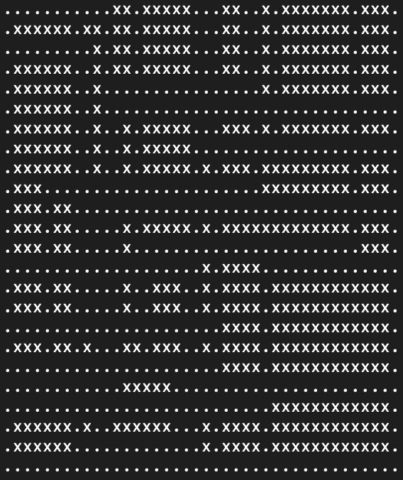

# Viikko 2

## Käytetty työaika:

- 25.7. Random Walk -algoritmin toteutus ja konsolipohjajinen ui - 7 h
- 29.7. Gradlen konfigurointien säätöä, tietorakenteiden toteutusta, refaktorointia - 6 h
- 30.7. Refaktorointia, perustietorakenteita, testejä - 8 h

## Mitä olen tehnyt tällä viikolla?

- Toteutin karttojen piirtämisen Random Walk -algoritmilla
- Toteutin perustietorakenteita: solmu, verkko, keko
- Kirjoitin testejä ja lisäsin käyttöliittymään toimintoja

## Miten ohjelma on edistynyt?

- Karttojen generointi toteutettu
- Perustietorakenteista tehty ensimmäiset versiot
- Refaktoroitu käyttöliittymää ja karttojen tulostusta -> yksittäiset kartat jäävät nyt talteen session ajaksi.
- Testien kirjoitus saatu alkuun, testikattavuus tietorakenteiden osalta hyvä, mutta käyttöliittymästä ja kartoista ne vielä puuttuvat.

## Mitä opin tällä viikolla / tänään?

- Viime viikon palautteesta opin, että JPS-algoritmi sopii parhaiten kartoille, jotka kuvaavat ihmisen rakentamaa ympäristöä, ei satunnaisille sokkeloisille kartoille. Algoritmin parhaat ominaisuudet eivät pääse oikeuksiinsa myöskään kartoissa, joissa esteitä on harvakseltaan. Kokeilujen jälkeen arvelisin, että Random Walk -algoritmillä saanee tuotettua algoritmille sopivia karttoja, kunhan tunneleita on riittävän paljon ja tunnelin maksimipituus on lähellä kartan sivun pituutta.

- Olen tutkinut erilaisia toteutuksia keosta 

## Mikä jäi epäselväksi tai tuottanut vaikeuksia? 

- Viime viikon raportista jäi kirjaamatta, että monta tuntia tuhlaantui kun ihmettelin, miksei syötteen luku toimi. Gradle-asetusista puuttui standardInput = System.in - määrittely.

- Ohjelmiston rakenteen suunnittelu tuntuu/tuntui vähän jumittavan. Arvoin esimerkiksi pitkään teenkö kaarille oman olion vai ei. En oikein osaa vielä ajatella ohjelmistoa kokonaisuutena vaan otan palasia haltuun yksi kerrallaan.

- Tuhlasin monta tuntia keon kanssa - pienen logiikkavirheen vuoksi testeissä sovellus palautti Nullpointer Exceptionin ja kesti kauan ennen kuin ymmärsin mistä se tulee: yritin tehdä swapin jälkeisiä toimia vaikka olin jo keon huipulla.

- Kysymys: riittääkö konsolipohjainen käyttöliittymä vai odotetaanko hienompaa esitystapaa?

## Mitä teen seuraavaksi?

- Seuraavaksi Dijkstra-algoritmi kunnolla työn alle ja sitten reitin tulostus kartalle.